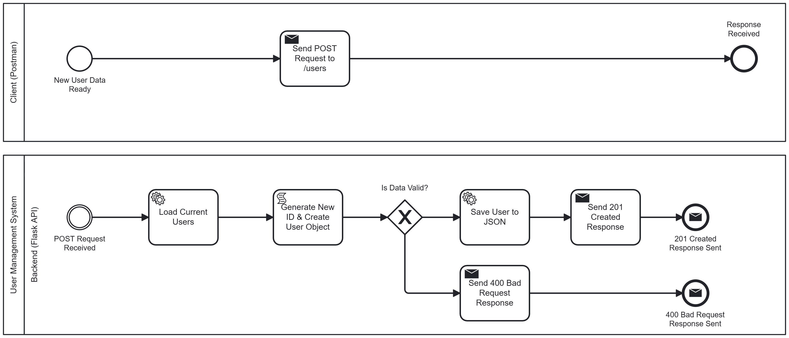

# Flask REST API with JSON Persistence

A professional User Management API built with Python and Flask. This project demonstrates modern software development practices, including **BPMN process modeling**, **Scrum methodology**, and **automated API testing**.

## 🚀 Features
- **Full CRUD functionality**: Create, Read, Update, and Delete users.
- **Persistence**: Data is stored in a local `users.json` file.
- **Error Handling**: Comprehensive validation for missing fields, duplicate IDs, and non-existent users.
- **Process Documentation**: Visualized workflow using BPMN 2.0 standards.

## 🛠️ Technology Stack
- **Backend:** Python, Flask
- **Database:** JSON (File-based persistence)
- **Design:** Camunda Modeler (BPMN 2.0)
- **Project Management:** Jira (Scrum)
- **Testing:** Postman

## 📊 Business Logic (BPMN)
The API workflow was designed prior to implementation to ensure robust logic.

*Figure 1: BPMN diagram of the User Creation process.*

## 📋 Project Management
The development followed **Scrum** methodology to ensure structured delivery. Tasks were organized into a focused Sprint with clear acceptance criteria.

<details>
<summary>📊 Click to view Sprint Completion Report (Jira)</summary>
<br>
<p align="center">
  
</p>
</details>

- **Epics:** `Project Design & Documentation`, `Core API Development`
- **Tasks:** Modeled as User Stories with specific Acceptance Criteria.
- **Tracking:** Developed in a dedicated Sprint (USER-1 to USER-5).

## 🔌 API Endpoints

| Method | Endpoint | Description |
| :--- | :--- | :--- |
| **GET** | `/users` | Get all users |
| **POST** | `/users` | Create a new user (requires `id`, `name`) |
| **PUT** | `/users/<id>` | Update an existing user's name |
| **DELETE** | `/users/<id>` | Remove a user by ID |

### Example Request (POST):
```json
{
    "id": 3,
    "name": "Jane Doe"
}

## ⚙️ Setup & Installation

1. **Clone, Install and Run:**
   Copy and paste the following commands into your terminal to get started:

```bash
# Clone the repository
git clone [https://github.com/your-username/flask-user-api.git](https://github.com/your-username/flask-user-api.git)

# Navigate to project folder
cd flask-user-api

# Install dependencies
pip install -r requirements.txt

# Run the application
python app.py

2. **Access the API: The API will be live at: http://127.0.0.1:5000/users**